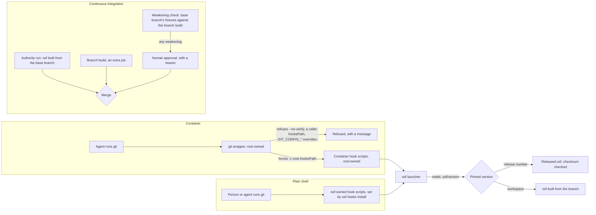

# 0018: Hook enforcement and the pinned osf

Status: accepted

Date: 2026-09-26

## Context

A trial of [open-software-factory/software-factory#151 (the development container)](https://github.com/open-software-factory/software-factory/pull/151), run against the hooks from [open-software-factory/software-factory#135 (the checkpoint runner)](https://github.com/open-software-factory/software-factory/pull/135), found two results. A git hook path set in a repository's own git config took effect ahead of one set in the container's system config. Its hooks never ran there. Separately, the copy of osf built into the container at image time did not recognise the `--checkpoint` flag that the branch under review used. Together these results settled how osf enforces its own git hooks, and which build of osf a hook or a check should run.

The diagram below adapts the one drawn for this decision.

## Options considered

**How strict local enforcement should be.**

| Option | What it meant | Outcome |
|---|---|---|
| Fast feedback only, for agents and people alike | A local hook always warns and never truly blocks, in the container or in a plain shell. | Set aside. Most changes are written by agents inside the container, which is exactly where a check needs to resist being bypassed. |
| Hard to skip everywhere, container and plain shell alike | A local hook is just as strict for a person in a plain shell as for an agent in the container. | Set aside. A person can always work around a check on a machine they control, so the extra friction buys nothing the pull-request checkpoint does not already give. |
| Hard to skip inside the container, fast feedback elsewhere | The container guarantees a hook ran; a plain shell offers the same check as a courtesy. | Taken. |

**Which osf build runs.**

| Option | What it meant | Outcome |
|---|---|---|
| The branch build, locally and as the authority | A branch that weakened a check would judge itself with that same weakened build and pass. | Set aside. |
| A pinned release, the same as any adopter uses | Every improvement to osf's own hooks and checks would wait for a release before it took effect on osf's own branches. | Set aside. |
| The osf built into the container image | This is the drift the trial found: an image built once falls behind a branch's own flag changes. | Set aside. |
| The branch build locally, the base branch's build as the authority, with the branch build also running in continuous integration as a second, non-deciding job | Taken. |

**How the container reaches its hooks.**

| Option | What it meant | Outcome |
|---|---|---|
| Writing the hooks path into each repository's git config when the container starts | A later write to that config, such as a clone or a config reset, can undo it before the next check runs, and every repository needs its own start step. | Set aside. |
| Hook scripts tracked in the repository, with no wrapper | An agent that can edit files can edit the hook script itself. | Set aside. |
| A root-owned git wrapper that forces the hooks path on every call | Git gives a command-line `-c` setting precedence over system, global and repository config, so a forced setting cannot be overridden from inside the repository. | Taken. |

**What the wrapper refuses.**

| Option | What it meant | Outcome |
|---|---|---|
| Refuse only `--no-verify` and a caller-supplied hooks path | Leaves the git config environment overrides open, and one open route makes refusing the others pointless. | Set aside. |
| Refuse the flag, the override and the environment overrides, but strip them silently | Hides what happened and invites a retry by another route. | Set aside. |
| Refuse all three with a message, and make the real git binary unreadable to the container user | The wrapper becomes the only git the container user can reach. | Taken. |

**A weakened check.**

| Option | What it meant | Outcome |
|---|---|---|
| No detection, relying on a reviewer to notice a weakened check | Relies on a person noticing exactly the kind of change a check exists to catch. | Set aside. |
| A separate pull request to relabel or update a fixture before any rule change | Adds a pull request to every fix, and still needs a human approval at the end. | Set aside. |
| Run the base branch's fixture corpus against the branch build, report each case the base branch catches that the branch misses, and require a human approval with a written reason before a weakening merges | Taken. |

**Which osf a repository runs.**

| Option | What it meant | Outcome |
|---|---|---|
| Detect osf's own repository as a special case in the hook script | Works for one repository and leaves every adopter's drift unnoticed. | Set aside. |
| Always run whichever osf happens to be on PATH | This is the drift the trial found. | Set aside. |
| A version file per repository, read by a small launcher on PATH | Taken. |

## Decision

### Local hooks, and the authority

Inside the development container, an agent cannot skip a hook, redirect it to a different path, or reach a git binary other than the wrapper. Outside the container, the same hooks give a person or an agent in a plain shell fast feedback, and they can be bypassed there. A plain shell always allows that. In both cases the pull-request checkpoint in continuous integration remains the authority. It decides whether a change merges, and it runs with a token the agent never holds.

### The container's git wrapper

A root-owned wrapper is the only git the container user can reach. The real git binary is made unreadable to that user. On every call the wrapper forces `-c core.hooksPath` to a root-owned, read-only directory of hook scripts inside the container. It refuses three things, each with a message. The first is the `--no-verify` flag. The second is a caller-supplied `core.hooksPath`. The third is the git config environment overrides: `GIT_CONFIG_COUNT`, `GIT_CONFIG_KEY_*`, `GIT_CONFIG_VALUE_*`, `GIT_CONFIG_GLOBAL`, `GIT_CONFIG_SYSTEM` and `GIT_CONFIG_PARAMETERS`. The container's hook scripts are thin. Each one only runs osf for the checkpoint it fires at.

### Each repository pins its osf version, and a launcher runs it

A repository states its osf version in `.osf/version`: a release number for an adopter, or `workspace` for osf's own repository. The `osf` command on PATH is a small launcher. It reads that file and runs the version it names, fetching a release by checksum or building the workspace copy. No hook or check ever runs whichever osf happens to be on PATH unpinned.

### Which osf runs a check on osf's own repository

Locally, osf builds and runs from the branch under review, so a change to a checkpoint's own flags is tested on itself. The extra job in continuous integration builds and runs that same branch copy. The authority run in continuous integration builds and runs osf from the base branch instead. A branch cannot weaken a check and then pass that weakened check's own verdict.

A flag rename lands in two steps. A build first accepts both the old and the new flag. Only a later build drops the old one. A hook running an older pinned osf then still calls a flag that build understands.

### A pull request that weakens a check

Continuous integration reads the base branch's fixture corpus and runs it against the branch build. It reports each case the base branch catches that the branch build misses, by rule and by fixture. A pull request with any reported weakening needs a human approval that states a reason before it can merge. The approval is recorded in the journal defined in [decision 0005](0005-the-factory-domain-model.md), in the same way a suppression is recorded under [decision 0015](0015-suppressions.md).

### Hooks outside the container, and the retirement of tracked hook scripts

A plain shell sets itself up once per machine with `osf hooks install`. This points `core.hooksPath` at an osf-owned location outside the repository, such as `~/.osf/githooks`, and checks that osf is on PATH. No repository tracks its own hook scripts, which retires the tracked hook directory that pull request [open-software-factory/software-factory#135 (the checkpoint runner)](https://github.com/open-software-factory/software-factory/pull/135) added. A fresh clone carries no hook files, and gets its hooks only once `osf hooks install` has run on that machine.

## Consequences

- Decision 0003 is amended to point at this record for how the hook, pre-commit and pre-push checkpoints are enforced locally.
- An IDE integration that legitimately sets a `GIT_CONFIG_*` variable fails inside the container until an allow rule covers it.
- The weakening check protects a rule only as far as its fixture corpus reaches. A rule with thin fixtures gets thin protection, so fixture coverage per rule becomes something to track.
- Continuous integration builds osf twice on a pull request that touches osf itself: once for the authority run and once for the branch build.
- The launcher needs a checksum check on every release it fetches, a cache per machine, and a clear failure when it cannot reach the network.
- A freshly cloned repository has no local hooks until `osf hooks install` runs once on that machine. A person can forget to run it, so `osf doctor` reports a repository with no hooks installed.
- Retiring the tracked hook directory changes pull request [open-software-factory/software-factory#135 (the checkpoint runner)](https://github.com/open-software-factory/software-factory/pull/135), which already tracks that directory.
