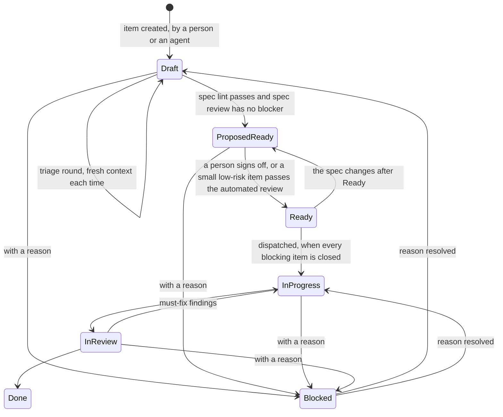

# 0019: What ready means, and the two levels of status

Status: accepted

Date: 2026-09-26

## Context

A backlog can only be drained by agents when each item says when it is done. This table shows how far short of that the backlog in open-software-factory/software-factory stood, on the day this record was settled.

| Measure | Count |
|---|---|
| Open issues | 132 |
| With a "Done when" or acceptance section | 29 |
| Naming a metric | 12 |
| Under 60 words | 82 |
| Of the first 100 checked, with an issue type | 100 |
| Of the first 100 checked, with a parent | 89 |

[The automated SDLC vision](../../vision/automated-spdlc-sdlc-vision.md) says spec quality limits throughput. It lists thirteen quality dimensions a spec may need.

[Decision 0005](0005-the-factory-domain-model.md) lists one flat set of lifecycle states for a work item. The factory's own project board uses a live Status field. It holds Backlog, Ready, In progress, Verifying, In review, Blocked, Paused, Failed and Done. No second field says what an agent is doing inside a state. [open-software-factory/software-factory#100 (deriving ready)](https://github.com/open-software-factory/software-factory/issues/100) already argues that the factory should derive "ready" instead of a person setting it by hand. Nothing existing gave a two-level status design or a mapping an adopter could use for its own statuses.

This record settles six things:

- what a work item's type requires before it is ready
- who checks that
- how an item moves from Draft to Ready
- how status splits into a coarse field and a finer one
- how a triage agent keeps items moving
- how the factory measures its own work

## Options considered

**Where the spec lives, and what decides its shape.**

| Option | What it meant | Outcome |
|---|---|---|
| A fixed set of body sections for every item | One template regardless of level. | Set aside. It ignores that a container and a unit of execution answer different questions. |
| A spec file in the repository, linked from a short issue | The tracker holds a pointer, the file holds the content. | Set aside. The tracker already carries the fields that drive the work, and a file splits them from the spec. |
| The item's size decides where its spec lives | A small item's spec sits in the issue, a large one in a file. | Set aside. A reader or an agent has to hunt for a spec whose location depends on size, and it hides whether the item is executed or broken down. |
| The tracker item is always the spec, and its type says what it must contain | Epic, Feature and Story are containers; Task, Chore and Bug are units of execution; every level can have children; design documents and decision records are linked inputs. | Taken. |

**How much a spec must cover.**

| Option | What it meant | Outcome |
|---|---|---|
| All thirteen vision dimensions on every item | Every item answers every question the vision lists. | Set aside. It pads small items with sections marked not applicable. |
| A core set of dimensions only, fixed per type | No dimension beyond the core ever applies. | Set aside. A real gap gets through wherever a heavier dimension applies, such as personal data or a production-behaviour change. |
| A small fixed core per type, plus dimensions triggered by what the work touches | The mapping from type and trigger to required dimension ships as overridable data. | Taken. |

**Who decides an item is ready.**

| Option | What it meant | Outcome |
|---|---|---|
| A person only | Every item waits on a person, including gaps a machine could catch. | Set aside. It is slow, and it wastes a person on a missing section a lint would find in a second. |
| Automated checks only | A lint and a model review promote an item with no person in the loop. | Set aside. The commitment to build a piece of work stays with a person until the review's agreement with the owner is measured. |
| A deterministic spec lint for structure, a model review with spec lenses for quality, and a person for the commitment | The lint checks sections, binary criteria and reference placement. The model review is reported evidence under [decision 0003](0003-deterministic-verification-is-authoritative.md) and never decides alone. | Taken, with the light sign-off below for small, low-risk items. |

**Default body content, and how an unusual item gets through.**

| Option | What it meant | Outcome |
|---|---|---|
| One core table, with no way to skip a part | An item that cannot supply a section stays not-ready indefinitely. | Set aside. Every unusual item would stay not-ready. |
| One body shape for every type | A checklist item gets asked for a success metric, or an Epic gets through with none. | Set aside. It either burdens a Chore with a metric or lets an Epic through without one. |
| A default table per type, with a waiver that records a reason and an expiry | A waiver turns a missing part into a recorded decision. | Taken. Two variants were also set aside. One dropped the success metric from Features, since a Feature is often where a metric can first be measured. The other added acceptance criteria to Bugs, but the expected behaviour already works as the acceptance condition. |

**How an item moves from Draft to Ready.**

| Option | What it meant | Outcome |
|---|---|---|
| Draft and Ready only | Two states, no place to queue an agent's proposal for a person. | Set aside. Agents cannot queue their refining work for a person. |
| Automatic promotion to Ready for small items, no person involved | A low-risk item skips the person entirely. | Set aside for now. Kept as a next step once the triage agent's proposals are measured against the owner's own sign-offs. |
| Draft, Proposed ready, Ready, with a light sign-off for small low-risk items | An agent may move an item to Proposed ready only when the spec lint passes and the spec review has no blocker. A person moves it to Ready, except that a low-risk Task, Chore or Bug can be signed off in one action from a batch list that shows the lint and review result beside each item. | Taken. |

**How status is shaped.**

| Option | What it meant | Outcome |
|---|---|---|
| One flat list of states, as decision 0005 has it | Every state an item can be in, agent steps included, sits in one field. | Set aside. An adopter would have to map agent steps that change often onto its own tracker. |
| Agent steps as labels | A label carries what an agent is doing inside In progress or In review. | Set aside. A label is weaker than a field for reporting and ordering; a tracker adapter may still fall back to a label where a second field is missing. |
| Two native fields: a coarse Status the factory acts on, and a finer Step only agents set | Status holds Draft, Proposed ready, Ready, In progress, In review, Done, plus Blocked, Paused and Failed. Step holds values such as implementing, verifying, awaiting second opinion and fixing review findings, and only applies inside In progress and In review. | Taken. |

**Whether an item is dispatchable, and how Blocked works.**

| Option | What it meant | Outcome |
|---|---|---|
| A stored "dispatchable" flag | A field an agent or a person could set directly, and could get out of step with reality. | Set aside in favour of a derived fact: Status is Ready and every blocked-by item is closed. |
| Blocked without a required reason | An item can be marked Blocked with no further detail. | Set aside. A lint refuses Blocked without a reason: what is missing, and who can supply it, a person or another item. |

**Who triages a new item, and how much memory it keeps.**

| Option | What it meant | Outcome |
|---|---|---|
| Comments with suggestions only | A triage pass leaves notes for a person to act on. | Set aside. Suggestions pile up unread. |
| A triage agent that may also mark a small item Ready | Triage both proposes and signs off. | Set aside. It contradicts the sign-off rule above until the agent's own proposals are measured against a person's. |
| One triage agent, run with a fresh context each round, that edits the body, adds links and evidence, proposes type and size, and moves an item only as far as Proposed ready | It never moves an item to Ready and never deletes a person's text. Each change is one batched comment saying what changed and why. Rounds may alternate model families and repeat under the goal loop in [open-software-factory/software-factory#155 (a shared goal loop)](https://github.com/open-software-factory/software-factory/issues/155). A round stops after a configured number, with a reason. | Taken. One triage workflow replaces an earlier two-workflow design. |

**Whether factory work is measured.**

| Option | What it meant | Outcome |
|---|---|---|
| No metrics for factory work | Whether a change to the factory helped stays a matter of opinion. | Set aside. |
| Adoption counts only | Count how many repositories use a feature. | Set aside. Adoption says nothing about whether a change made the factory itself better. |
| Metrics computed from the journal: lead time from Ready to merged, review rounds per change, checks that could not run, false alarms per rule, human interventions per item, and cost per change | A factory Epic or Feature names which of these it should move, and by how much, measured on this repository and on an adopting repository. | Taken. The set grows as the meta-loop's analysis of journal traces finds more. |

## Decision

### The work item is always the spec

Epic, Feature and Story are containers. Their spec states the goal, the outcome and, where it applies, the success metric. They are done when their children are done and the outcome holds. Task, Chore and Bug are the units of execution. Every level can have children. Design documents and decision records are linked inputs. The item itself stays the source of truth. A later, composed view can read a spec across its levels without moving where any of it lives.

### Dimensions: a small core per type, plus what the work touches

Each type carries a small fixed core of what its body must cover. A dimension from the vision's larger list applies only when the work touches its area. Examples are personal data, a data migration, a public interface and production behaviour. The mapping from type and trigger to dimension ships as overridable data. It works the same way the review lenses in [decision 0016](0016-the-review-check.md) already do.

### Readiness: a lint, a model review, and a person

A deterministic spec lint checks structure: the required sections are present, acceptance criteria are binary, and references are placed where the type expects them. A model review with spec lenses judges quality and reports its result as evidence that never decides alone, under decision 0003. A person sets an item to Ready, except for the light sign-off below.

### Default content per type, with waivers

Type, size, priority, parent, blocked-by and source are native fields at every level. The body never repeats them.

| Type | Body content by default |
|---|---|
| Epic, Feature | Goal, why, outcome, success metric, numbered acceptance criteria |
| Story | Goal, why, numbered acceptance criteria |
| Task, Chore | A checklist of items to complete, each checkable |
| Bug | Expected behaviour, actual behaviour, steps to reproduce, environment, a checklist for the fix, and optional evidence: log links, product data, customer feedback, screenshots or video |

A triggered dimension applies at any level whose work touches its area. A waiver on the item skips a part, with a reason and an expiry. Recording a waiver turns a missing part into a documented decision.

### The path to Ready, and the light sign-off

The spec's path is Draft, Proposed ready, Ready. An agent may move an item to Proposed ready only when the spec lint passes and the spec review has no blocker. A person moves it on to Ready. Ready also covers a small, low-risk item that the automated review alone was enough to check.

For a low-risk Task, Chore or Bug, sign-off is one action from a batch list. That list shows the lint result and the review result beside each item. A larger or higher-risk item still needs the person to open it.

Ready means the item is broken down into pieces an agent can pick up. The tracker itself is the queue, so a Ready item can still wait on its dependencies. An edit to the spec after Ready moves the item back to Proposed ready.

### Two native status fields

Status is the coarse state the factory acts on. Its values are Draft, Proposed ready, Ready, In progress, In review, Done, Blocked, Paused and Failed.

Step is a finer field that only agents set. It only applies inside In progress and In review, with values such as implementing, verifying, awaiting second opinion and fixing review findings.

Whether an item can be dispatched is never stored, only derived. An item is dispatchable when Status is Ready and every blocked-by item is closed.

An adopter maps its own statuses onto the coarse states in `osf.toml`. The steps stay the factory's own and need no mapping.

Blocked can be entered from any stage and always carries a reason. The reason says what is missing and who can supply it, a person or another item. An agent that stops for lack of guidance, context or data moves the item to Blocked with that reason. A lint refuses Blocked without one.

This amends the flat lifecycle that decision 0005 gives a work item. See the amendment note there.

### The spec and triage agent

Every new item is triaged, whatever its length and whoever created it. Even an item an agent wrote together with a person benefits from an independent pass. Triage runs when an item is created or edited in Draft, and on a schedule over stale drafts. It may:

- edit the body
- add links and evidence it found, such as logs, code references and related items
- propose a type, a size, a source and children
- move the item to Proposed ready, once the checks pass

Triage never moves an item to Ready. It never deletes a person's text. It records each change as one batched comment that says what changed and why.

Each round starts a fresh agent run. It has no memory of the previous round. It reads only the item as it now stands, and its change comments. Rounds may alternate model families.

Triage is a natural user of the goal loop in [open-software-factory/software-factory#155 (a shared goal loop)](https://github.com/open-software-factory/software-factory/issues/155). It repeats until the checks pass. It stops after a configured number of rounds, with a reason.

Refining the existing backlog is scoped narrowly at the outset. Only the items on the path to building the triage agent are refined now. The triage agent takes on the rest once it exists.

### Success metrics for factory work

Factory metrics come from the journal that decision 0005 defines:

- lead time from Ready to merged
- review rounds per change
- checks that could not run
- false alarms per rule
- human interventions per item
- cost per change

A factory Epic or Feature names which of these it should move, and by how much. The metrics are measured on this repository and on an adopting repository. The set grows as the meta-loop's analysis of journal traces finds more. This applies while the factory builds itself.

## Consequences

- Decision 0005 is amended. Its one flat list of lifecycle states is replaced, from Draft to Ready, by the two fields and the path this record sets. Its amendment note points here.
- Every tracker adapter needs a second status-like field, or a fallback label where one is missing. An adopter's `osf.toml` gains the mapping from its own statuses to the coarse states.
- The per-type table and its trigger list become something to maintain. A trigger that misfires either asks for an irrelevant section or misses a needed one.
- Waivers can accumulate. An expiry on each one, and a count per item, keep that visible rather than silent.
- A batch sign-off list could invite rubber-stamping if it ever hid the lint and review result. The list must keep showing both, beside each item.
- An item created with the wrong type gets the wrong default body. Triage is expected to catch this on its first pass.
- A busy triage agent risks adding noise to an item's history. Batching its edits into one comment per round bounds that.
- Some of the success metrics need a baseline measured before they can show movement.
- The spec lint, the spec review lenses and the triage agent are still to be built. The triage agent will use the goal loop in [open-software-factory/software-factory#155 (a shared goal loop)](https://github.com/open-software-factory/software-factory/issues/155).
