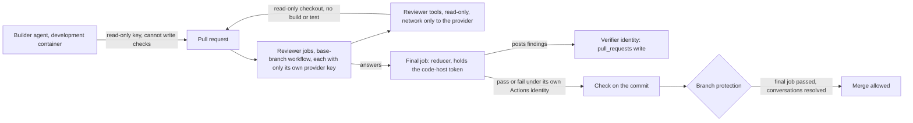

# 0020: Who can post a review result the factory trusts

Status: accepted

Date: 2026-09-27, amended 2026-10-03: each reviewer runs in a CI job of its own with only its own key, and a reviewer reads the change with read-only tools inside a sandbox, so the reason for reading the pull request as data is superseded.

## Context

[Decision 0016 (the review check)](0016-the-review-check.md) made the review a check on the pull request, decided by a deterministic reducer over several reviewers' answers. It left open who runs that check and who can make it pass.

The first design had the check posted from the development container, using the verifier app's token. An agent working inside that container can reach the same token. It could post a passing result without a real review. A second gap sits behind the first one. Nothing in the factory names one place where it runs. No server is always up. The console is only a viewer, and a person starts and stops it, so nothing can depend on it running. The factory should run its own work through the code host's and the CI system's own mechanisms, wherever it can.

This record settles who can post a review result the factory trusts, and how the factory runs without a server of its own.

### Amendment, 2026-10-03

Before 2026-10-03, this record gave one reason for how reviewers meet the pull request: the review reads the pull request as data and never runs it, to resist steered text. It left these limits open. A reviewer's shell could be absent or read-only, and the choice was deferred. Network access "should stay limited". A single review job held the keys of every reviewer.

That reason is superseded. Reading the pull request as data still holds, because the job never builds or runs it. But a reviewer receives only metadata and reads the rest itself, as [decision 0016 (the review check)](0016-the-review-check.md) sets out, so it reads far more of the text that an agent or a fork wrote. What limits steered text is how little a steered reviewer can do. How much the reviewer reads does not limit it.

Prompt injection is still a risk. The design contains it with these limits:

- A reviewer has read-only tools only, with no write tools and no shell beyond read-only use.
- A reviewer holds no secret beyond its own provider's key, because each reviewer runs in a CI job of its own. Only the final job holds the code-host token.
- A reviewer's network is open only to its own model provider.
- The quote check keeps a fabricated location out of the result.
- The reducer needs quorum, and a verified blocker vetoes the lens.

What the design cannot contain is unchanged. A steered reviewer can attach a false severity or description to a genuine quote, and it can return high scores with no findings, which passes the review.

## Options considered

**Who a passing result must resist.**

| Option | What it meant | Outcome |
|---|---|---|
| Guard against a builder agent only | Only an agent working inside the pipeline is stopped from forcing a pass. | Taken. |
| Also guard against a person with write access | Put the review on a separate CI identity with its own logins. | Set aside. A person with admin rights can already turn off branch protection, so this would add friction for little gain. |
| Guard against accidents only | Stop an unintended pass, but not a deliberate one. | Set aside. It leaves open the exact gap this record closes. |

**Where the private keys live.**

| Option | What it meant | Outcome |
|---|---|---|
| Repository secrets in CI, a mounted read-only key in the container | A CI job mints a short-lived, narrowly scoped token. The container mounts only the builder's key, and the builder app cannot write a check with it. | Taken. |
| A host-side process that mints tokens | A process on one machine hands out tokens on request. | Set aside. It needs a process that always runs, and the factory has none. |
| Each sandbox holds its own role's key | A review sandbox would carry the verifier's key directly. | Set aside. The container split above already covers the builder; the verifier key never needs to enter an agent's workspace at all. |
| An operating-system secret store | Keys held in a platform credential store instead of repository secrets and a mount. | Set aside for now. It can follow later behind the same split. |

**How the review job resists tampering.**

| Option | What it meant | Outcome |
|---|---|---|
| A workflow whose file always comes from the base branch | The pull request cannot edit the file that judges it. | Taken. |
| An ordinary pull-request workflow, with required review on workflow files | A person must approve any change to the workflow file before it can run. | Set aside. It depends on a person noticing a workflow change inside a larger diff. |
| Remove workflow-write permission from the builder app | Stop the builder app from ever changing a workflow file. | Set aside. The factory's own agents need that permission to work on its CI files. |

**Where the factory runs.**

| Option | What it meant | Outcome |
|---|---|---|
| CI workflows, on the runners the adopter chooses | The develop step and the review step are both CI jobs, using the same container image. | Taken. |
| A dedicated verifier machine, or a second user in the builder's container | A fixed place, separate from the builder, always available to run a review. | Set aside. Both assume a factory location that does not exist. |

**What counts toward merging.**

| Option | What it meant | Outcome |
|---|---|---|
| The CI review job only | A run before the push is a warning; only the CI run can pass or fail the merge. | Taken. |
| Also accept a pass recorded before the push | Let an earlier, local pass count toward the merge, carried forward by a build cache. | Set aside. It conflicts with the rule that a builder agent cannot force a pass, since the local run happens in the agent's own workspace. |
| Drop the pre-push run entirely | Only ever review in CI. | Set aside. A run before the push is a cheap, early signal, even though it cannot decide the merge. |

**Who picks the runner and credentials.**

| Option | What it meant | Outcome |
|---|---|---|
| The adopter's own settings decide | A repository variable picks the runner, and the adopter's own secrets hold each reviewer's own provider key. | Taken. |
| Self-hosted runners only | Every adopter must run its own CI hardware. | Set aside. It forces one setup on every adopter. |
| Hosted runners only | Every adopter must use the code host's runners. | Set aside. It rules out an adopter with its own hardware and tools already signed in. |

**Who can write the shared cache.**

| Option | What it meant | Outcome |
|---|---|---|
| Only a base-branch workflow writes the cache | A cache entry a builder agent's own run produced is never reused as if it were a pass. | Taken. |
| Any job writes, and the review ignores cached review results | Only the review step distrusts the cache; other results reuse it freely. | Set aside. A builder agent could still poison a build or a test result that a later gate reuses. |
| No shared cache | Skip the question until a shared cache exists. | Kept as a valid starting point; the rule applies once a shared cache is added. |

**How the review's keys are held.**

| Option | What it meant | Outcome |
|---|---|---|
| Each reviewer in its own CI job, holding only its own provider's key | A final job combines the answers with the reducer and posts the result. Only the final job holds the code-host token. | Taken. |
| A single job holding every reviewer's key and the code-host token | The reviewers and the poster share one environment. | Set aside. A reviewer that reads files and is steered could reach every key in the job, and the token that posts the result. |

**Whether the review job runs code.**

| Option | What it meant | Outcome |
|---|---|---|
| Check out the pull request as read-only data | Reviewer tools read files and diffs. They are read-only: read, search and list. There are no write tools and no shell beyond read-only use. | Taken. |
| Build and test it inside the review job | Run the pull request's own code next to the job's secrets. | Set aside. That is the known attack on a workflow that runs from the base branch: build and test already happen in the ordinary CI jobs. |
| Read only the diff, through the code host's API | Skip a full checkout. | Set aside. It loses the surrounding file context that a review lens needs. |

## Decision

### 1. A builder agent must not be able to force a passing result

No builder agent can produce a passing result unless a real review passed on that exact commit. This guard targets an agent inside the pipeline. A person with admin rights can already turn off branch protection some other way, so guarding against people adds little. The target is a deliberate attempt to force a pass.

### 2. Keys are split by where the work runs

In CI, private keys live in repository secrets. A job mints a short-lived token, scoped only to the permissions that job needs, using the code host's own token-minting action. Each reviewer's job holds only its own model provider's key. Only the final job of the review, which combines the answers and posts the result, holds the code-host token. Inside the development container, only the builder's key is mounted, and the builder app can only read checks, so that key cannot write one. The verifier's key never enters an agent's workspace.

### 3. The review job runs from the base branch

The review is defined in a workflow that always runs the base branch's own file. It checks out no pull request code to run. Its jobs are a reviewer job for each reviewer, and a final job. A reviewer job holds only its own provider's key in repository secrets. The final job combines the answers with the reducer and posts the result, and it alone holds the code-host token. GitHub posts a job's pass or fail as a check under its own identity, so no app needs permission to write checks directly. An ordinary pull-request workflow would run the file from the pull request's own branch instead, and the builder app holds permission to write workflow files. A pull request from the builder could otherwise change the review job to always pass. Running the job from the base branch closes that gap. The job that judges a pull request is always one that was already reviewed and merged into the base branch. For the same reason, the review reads its lenses, its prompt file and its review settings, such as the chosen reviewers and the pass threshold, from the base branch. A pull request cannot weaken its own review by editing them.

### 4. The factory has no server, so reviews run as CI workflows

The develop step is a CI job that runs in the development container image. An agent takes a work item, builds it, runs the checkpoints, and opens the pull request under the builder identity. The review is a separate workflow, run from the base branch, whose reviewer jobs also use the container image, because they run agent reviewers. The container image is used only by jobs that do agent or model work. The console stays a viewer that a person starts and stops. The factory's own command line runs the work inside the workflows instead of inside the console. Other code hosts and CI systems stay in view for later: an adapter can supply the same events and jobs without changing this shape.

### 5. The CI review job is the gate

Branch protection requires the final job of the review from the base-branch workflow. A review run before the push, inside the builder agent's own workspace, is an early warning only, and it never counts toward the merge. The agent has a shell in its own workspace, so a run there could be made to report a pass. The pre-push run stays, as a cheap, early signal.

### 6. The adopter decides the runner and the reviewer credentials

The review workflow's runner and the reviewer tools' credentials both come from the adopter's own settings. A repository variable picks the runner. Secrets hold each reviewer's own provider key. The factory reads neither. The workflow ships with a default runner. This covers an adopter with its own runner and tools already signed in. It also covers an adopter using the code host's own runners, with API keys for a low-cost model.

### 7. Only a base-branch workflow writes the shared build cache

If a shared build cache is used, only a base-branch workflow writes to it. A run before the push, and a person, may read it, but may not write to it. A cache keys an entry by a hash of a task's inputs, without recording who wrote it, so a reader trusts every writer. With this rule, the review job can skip work a trusted job already did, such as a rerun on the same tree after a rebase. It never skips a review because the builder said so. No shared cache yet is a valid starting point. This rule applies once one is added.

### 8. The review jobs read the pull request and never run it, inside a sandbox

A reviewer job checks out the pull request as data, and never builds, tests or runs it. A reviewer receives metadata and reads the rest itself, as [decision 0016 (the review check)](0016-the-review-check.md) sets out. This sandbox makes that safe:

- The tools are read-only: read, search and list. There are no write tools.
- There is no shell beyond read-only use.
- The network is open only to that reviewer's own model provider.
- The job holds no secret beyond that provider's key, as decision 3 sets.
- The quote check stays, so every finding must cite code that exists.

An agent with no read-only mode cannot be a reviewer until it has one. A run that selects it reports could-not-run, with the reason.

A pull request from a fork waits for a maintainer's approval before the jobs run. Running pull request code next to a job's secrets is the known attack on a base-branch workflow. Build and test already run in the ordinary CI jobs.

Prompt injection is still a risk, because a reviewer reads text that an agent or a fork wrote. The sandbox limits what steered text can do. The final job's reducer, in [decision 0016 (the review check)](0016-the-review-check.md), checks that every finding's quoted code exists at the file and line it names, and requires the quorum its interim policy sets. That keeps a fabricated location out. It does not check a finding's claim, so steered text can still attach a false severity or description to a genuine quote. It also does not stop a reviewer returning an all-high-score answer with no findings at all. Prompt injection aimed at silence, rather than at a forged finding, can still pass a review this way.

### Routine choices

Branch protection requires both the review job and every review conversation resolved. The check shows that a review ran and passed. Resolved conversations show that a person dealt with each finding.

Findings are posted on the pull request as review comments under the verifier identity, which holds permission to write pull request comments. A must-fix finding fails the review job.

A later pull-request workflow can react to a failed review job or a new comment and restart the builder to fix it. Until that workflow exists, a person restarts the builder by hand.

The current installed permissions of the two apps ground this record:

| App | Permissions |
|---|---|
| builder | `checks: read`, `statuses: read`, `contents: write`, `pull_requests: write`, `issues: write`, `workflows: write`, `actions: write`, `actions_variables: write`, `secrets: read` |
| verifier | `checks: read`, `statuses: read`, `contents: read`, `pull_requests: write`, `issues: write` |

Neither app can write a check or a commit status. That is what lets decision 3 work. GitHub's own Actions identity posts the pass or fail. No app needs permission for that, and none is granted.

## Consequences

- A base-branch workflow with secrets still reads text that an agent, or a fork, wrote. A reviewer tool could be steered by that text. The sandbox in decision 8 limits the damage. A steered reviewer can read only its own key, and its network reaches only the provider that issued that key. The limit holds only while the network rule is enforced for every reviewer job, so the review workflow must set it for each.
- The builder app holds `workflows: write`, `actions: write` and `actions_variables: write`. It could change a repository variable the review workflow reads, such as the runner choice, or cancel and rerun jobs. Which variables the review workflow trusts should be reviewed, and taking `actions_variables: write` away from the builder app is worth considering.
- `pull_request_target` is easy to misuse. A later change that checks out and runs pull request code under it would bring back the attack this record closes. A lint on the workflow file should refuse that pattern.
- Branch protection still needs a person with admin rights to turn it on. Until then, none of this is enforced.
- A shared build cache is deferred until build times make one worth adding. Decision 7 applies once it exists.
- Support for other code hosts and CI systems is deferred until a first adopter needs one. An adapter would then supply the same events, jobs and job results.
- Each agent's read-only mode must be checked before the agent can review. An agent with none reports could-not-run until it has one.
- Splitting the review into a job for each reviewer and a final job adds jobs, and so runner use, to every pull request.
- [open-software-factory/software-factory#178 (the review check)](https://github.com/open-software-factory/software-factory/issues/178) must be reworked to match this record. It needs these changes:
  - bring the review back as a base-branch workflow with an adopter-set runner
  - run each reviewer in a job of its own with only its own provider key, and add a final job that holds the code-host token
  - give each reviewer metadata and read-only tools, with the sandbox in decision 8
  - post findings as review comments under the verifier identity
  - fail the final job on a must-fix finding
  - keep the pre-push run as a warning only
