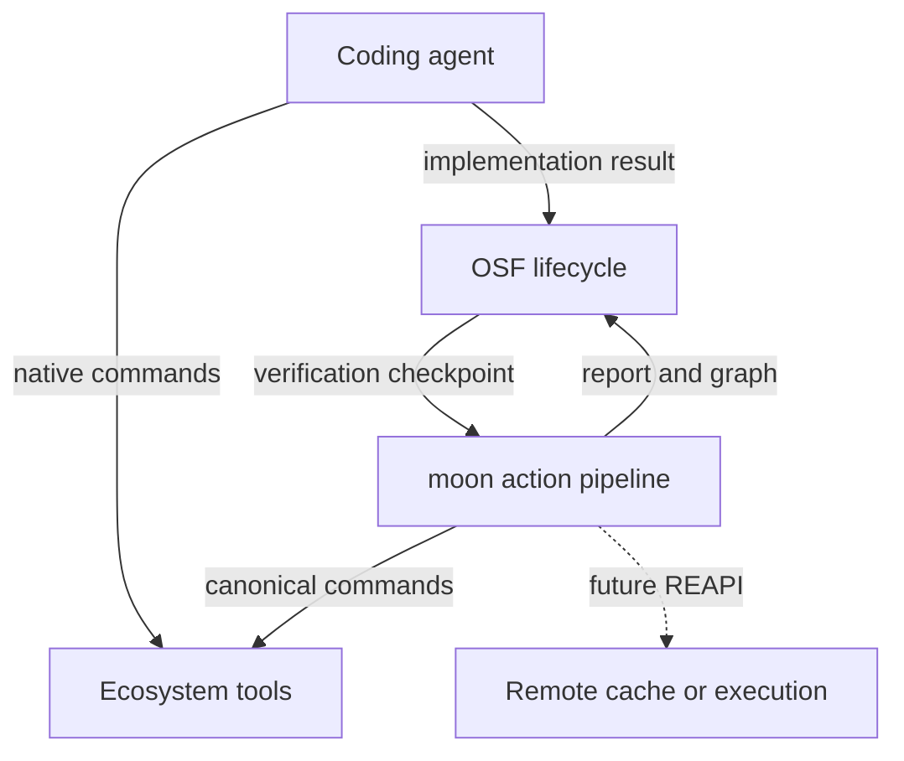

# OSF Execution and Verification Architecture

**Status:** Proposed high-level design  
**Date:** 2026-09-18  
**Decision basis:** [Moon as the OSF Execution Substrate](../research/2026-09-18-moon-as-osf-execution-substrate.md)

## Decision

OSF will use moon as an external execution-orchestration dependency for canonical deterministic verification. Native ecosystem tools remain responsible for compiling, testing, linting, analysing and packaging their own projects.

Coding agents may use native commands directly during implementation. OSF invokes moon at lifecycle checkpoints and treats those checkpoint results as authoritative evidence.

OSF will not initially provide an `osf exec` command, intercept every agent command, embed moon's Rust crates, fork moon, or implement its own task graph and cache.

## Architectural principles

1. **Own the policy and leave build semantics alone.** OSF decides what evidence is required and when. It does not teach .NET, Rust, Go or JavaScript how to build.
2. **Native tools remain native.** Canonical tasks invoke ordinary ecosystem commands rather than replacing them.
3. **Authoritative checkpoints are explicit.** Agent feedback runs may be informal; lifecycle transitions require the canonical moon graph.
4. **One owner for task identity.** Moon owns task inputs, outputs, dependencies, hashes and cache keys.
5. **One owner for lifecycle evidence.** OSF correlates verification outcomes with specifications, work items, gates and releases.
6. **Adopt through stable boundaries.** OSF depends on moon's binary, CLI, structured reports and graph exports rather than internal crates.
7. **Increase execution strength progressively.** Isolation, hermeticity and remote execution are added only where their value exceeds their adoption cost.
8. **Prefer open protocols to backend coupling.** Future distributed execution should target REAPI rather than a particular service.

## System boundary



The direct native-command path is the fast implementation loop. The OSF-to-moon path is the authoritative verification loop.

## Responsibility allocation

| Concern | Owner | Notes |
| --- | --- | --- |
| Product intent and specification | OSF | Source of required outcomes and acceptance criteria |
| Agent selection and coordination | OSF | Includes retries, escalation and work-item state |
| Lifecycle transition policy | OSF | Determines which gates are required |
| Verification evidence | OSF | Persists results against the work item and release |
| Project and task graph | moon | Canonical topology for deterministic tasks |
| Affected calculation | moon | Selects work based on changed inputs and graph relations |
| Task scheduling and concurrency | moon | Executes the canonical graph |
| Task hashing and caches | moon | Sole owner of task identity and cached outputs |
| Build and test semantics | Ecosystem tools | `dotnet`, Cargo, Go, pnpm and others |
| Toolchain installation | Ecosystem or moon/proto | Chosen per language and maturity; avoid duplicate ownership |
| Local process isolation | Deferred | Introduce only when verification policy requires it |
| Remote cache or execution | REAPI backend | Optional infrastructure behind an open protocol |

## Command model

### Agent commands

Agents use the commands most natural to the repository and problem:

```text
dotnet build
dotnet test tests/Api.Tests
cargo test parser::tests
go test ./internal/...
pnpm vitest src/example.test.ts
```

OSF does not rewrite these commands. They provide fast feedback and benefit from the ecosystem's own incremental mechanisms. Their success alone does not satisfy a factory gate.

Agents may choose to run a moon target when useful, but OSF must not rely on an agent remembering to do so.

### Canonical tasks

Repositories declare canonical deterministic tasks in moon. Those tasks invoke the same ecosystem tools with stable arguments, inputs, outputs, dependencies and environment expectations.

Conceptually:

```yaml
tasks:
  build:
    command: dotnet build --no-restore
  test:
    command: dotnet test --no-build --no-restore
    deps:
      - build
  verify:
    deps:
      - lint
      - test
      - architecture
      - security
```

The concrete task shape remains repository-owned moon configuration. OSF does not generate or duplicate it initially.

### OSF checkpoints

An OSF checkpoint maps a lifecycle gate to one or more moon targets or a declarative moon execution plan.

Example conceptual policy:

```yaml
verification:
  implementation-complete:
    moonTargets:
      - "~:verify"
  pull-request-ready:
    moonTargets:
      - ":verify"
    affected: true
  release-ready:
    moonTargets:
      - ":release-verify"
    affected: false
```

This is illustrative, and no part of it is a committed OSF schema. The important boundary is that OSF names canonical moon work while moon defines that work.

## Checkpoint flow

1. An agent reports that an implementation step is ready.
2. OSF resolves the verification policy for the lifecycle transition.
3. OSF invokes the pinned moon binary with the required targets or execution plan.
4. Moon constructs the action graph, resolves affected tasks, checks caches and executes missing actions.
5. OSF captures process status, structured run data and relevant logs.
6. OSF attaches the evidence to the specification and work item.
7. A passing result advances the lifecycle. A failing or incomplete result returns the work to an agent or escalates according to policy.

## Evidence model

OSF should persist a normalised gate result rather than treating raw console output as the record.

Minimum evidence:

- OSF work-item and specification identifiers;
- repository and revision;
- checkpoint and required moon targets;
- moon version and relevant configuration revision;
- start and completion timestamps;
- aggregate status;
- task-level status, duration and cache outcome where available;
- pointers to retained logs and artifacts;
- failure classification and retry history;
- execution platform identity.

Moon's native run reports and action-graph JSON are inputs to this evidence model. OSF should retain the raw source report when practical, while exposing a stable OSF-level representation to the rest of the factory.

OSF must not recompute moon's cache keys or attempt to reproduce its scheduling decisions.

## Failure semantics

Failures belong to different owners:

| Failure | Owner for diagnosis | OSF behaviour |
| --- | --- | --- |
| Ecosystem command fails | Coding agent | Return failing task evidence to implementation loop |
| Moon configuration is invalid | Repository maintainer or agent | Block gate; classify as verification-infrastructure failure |
| Moon binary is unavailable or wrong version | OSF runtime | Do not interpret as a code failure; repair environment or escalate |
| Cache service is unavailable | moon and OSF runtime policy | Prefer local execution when safe; record degraded mode |
| Evidence cannot be persisted | OSF | Do not advance a gate that requires durable evidence |
| Task is non-deterministic or cache is suspect | Product engineer and meta-loop | Force clean execution; recalibrate inputs or cache policy |

## Versioning and distribution

Each OSF-compatible repository should pin a supported moon version. OSF may later manage installation, but the first implementation should prefer the smallest reliable mechanism supported on Windows, macOS and Linux.

OSF should verify the moon version before a canonical checkpoint and include it in the evidence record. Version upgrades should be deliberate and validated against representative repositories.

Moon remains a separately licensed external dependency. If OSF distributes its binary, OSF must retain moon's MIT licence notices. OSF's own source remains dual-licensed under Apache-2.0 and MIT.

## Caching

### Local cache

Local moon caching is the first target. It should accelerate repeated gates on the same workspace without adding infrastructure or trust-domain complexity.

### Shared remote cache

Remote caching is optional and should follow demonstrated need. Moon already supports REAPI-compatible Action Cache and CAS services. OSF should configure this through moon rather than introducing its own cache client.

Before shared results are treated as authoritative, repositories must have sufficiently complete task inputs and controlled toolchain identity. A fast incorrect cache hit is worse than a slow correct execution.

### Remote execution

Remote execution is deferred. If adopted, it should use the REAPI `Execute` boundary and remain backend-neutral. NativeLink, BuildBuddy, BuildBarn or another compatible service may be evaluated independently.

## Isolation and hermeticity

Moon's current task hashing and declared inputs are useful but do not enforce filesystem or network isolation. OSF must not label a tracked moon task as hermetic.

The future policy model may distinguish:

- native tasks;
- tracked tasks;
- controlled-environment tasks;
- isolated tasks;
- hermetic tasks;
- remoteable tasks;
- remotely executed tasks.

The policy should be per task or gate. Stronger execution is most valuable for release, security and compliance gates; it may be actively harmful to interactive development tasks.

No isolation wrapper is part of the initial design. When that need becomes concrete, OSF should first determine whether enforcement belongs in moon, the coding-agent runtime, a sandbox service or the CI executor.

## Public CLI surface

No `osf exec` command is proposed.

OSF may have internal process-launching code that invokes moon, just as it invokes an agent or version-control tool. That implementation detail does not justify a public generic command.

A public execution command should be introduced only if it expresses a stable OSF concept that moon does not already express. Potential future examples include an explicitly policy-bound sandbox session or a replayable evidence-producing action. Generic subprocess forwarding is not enough.

## Observability

The OSF execution view should combine:

- lifecycle context from OSF;
- action and dependency topology from moon;
- live or completed process state;
- cache-hit and affected-task information;
- task logs and artifacts;
- gate decision and escalation state.

This supports the factory-floor and drill-down UX without asking OSF to become the execution engine. Moon supplies execution truth; OSF supplies product and lifecycle meaning.

## Adoption stages

### Stage 1: Canonical local verification

- Pin moon.
- Define representative tasks.
- Invoke moon from OSF checkpoints.
- Capture exit status and structured reports.
- Keep agents on native commands.

### Stage 2: Affected execution and evidence

- Enable affected selection for appropriate gates.
- Persist normalised task-level evidence.
- Integrate action topology into OSF observability.
- Validate clean-run equivalence periodically.

### Stage 3: Shared caching

- Add a REAPI-compatible remote cache when measurement justifies it.
- Establish cache trust, retention and isolation policies.
- Measure time and infrastructure savings.

### Stage 4: Stronger local execution

- Introduce controlled environments or sandboxing for selected gates.
- Make execution-strength policy explicit.
- Verify cross-platform behaviour.

### Stage 5: Remote execution

- Adopt only after actions are accurately declared and remoteable.
- Use REAPI and retain backend neutrality.
- Keep side-effecting deployment and publication actions outside retryable remote execution.

## Non-goals

- Replacing native build systems.
- Requiring agents to learn an OSF-specific build language.
- Routing every exploratory command through moon.
- Making all tasks hermetic immediately.
- Building CAS, scheduling or remote workers.
- Committing to NativeLink or another backend.
- Exposing moon's internal data model as OSF's public domain model.

## Deferred decisions

- Moon installation and upgrade mechanism.
- Exact OSF checkpoint configuration schema.
- Required moon version and compatibility window.
- Persistence format for raw moon reports.
- Mapping of cache outcomes into the OSF event model.
- Cross-platform sandbox technology.
- Criteria for enabling remote cache and remote execution.
- Whether future moon capabilities remove the need for any OSF-side execution adapter.

## Consequences

### Positive

- OSF avoids becoming a build system.
- Agents retain familiar, language-specific workflows.
- Canonical verification gains graph execution, affected selection and caching.
- The integration begins with a small process boundary.
- OSF can evolve toward REAPI without committing to remote infrastructure now.
- Moon and OSF retain independent release and implementation freedom.

### Negative

- Direct agent commands do not benefit from moon's cache or complete graph.
- Native feedback and canonical verification may occasionally differ.
- Repositories must maintain accurate moon task declarations.
- OSF depends on moon's CLI and report compatibility.
- Full hermeticity remains unsolved until a later execution layer enforces it.

These costs are preferable to intercepting every command or recreating moon's execution substrate.
