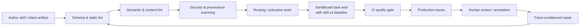
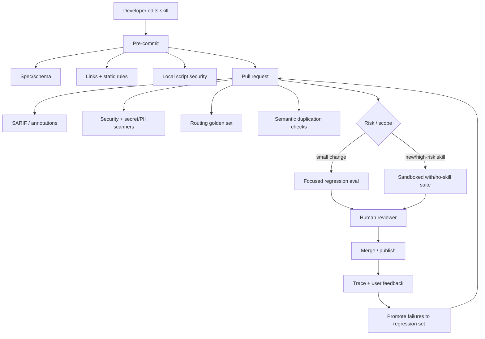

# Skill-Lint in 2026: The State of Validation, Testing, and Evaluation for Agent Skills, Voice Skills, Chatbot Intents, and Human-Skill Metadata

## Executive summary

**Yes. “Skill-lint” is now a real practice, and by September 2026 there are multiple projects that use almost exactly that term.** The clearest literal example is [`swarmclawai/agent-skills-lint`](https://github.com/swarmclawai/agent-skills-lint), a TypeScript cross-agent linter created in April 2026 for Claude Code, Codex, OpenCode, Aider, Copilot, Cursor, Gemini and other agent ecosystems. More substantial projects use names such as *validator*, *evaluator* or *scanner*: [`agent-ecosystem/skill-validator`](https://github.com/agent-ecosystem/skill-validator), [`michellepellon/skillmark`](https://github.com/michellepellon/skillmark), [`NVIDIA/SkillSpector`](https://github.com/NVIDIA/SkillSpector), and especially [`NVIDIA/SkillEvaluator`](https://github.com/NVIDIA/SkillEvaluator). The latter has evolved the idea beyond linting: deterministic validation → semantic/context checks → live sandboxed runs **with and without the skill** to measure whether the skill actually improves an agent.

That progression is the most important finding of this research. In early/mature software linting, a linter answers “is this source artifact well formed and suspicious-pattern-free?” For AI skills, that is necessary but nowhere near sufficient. A perfectly valid `SKILL.md` can be badly routed, redundant, ignored by the agent, actively reduce task success, contain semantically malicious instructions, or work only for one particular model. The state of the art in September 2026 is therefore better described as **skill assurance**:



That architecture is no longer hypothetical. NVIDIA's current SkillEvaluator implements three closely matching tiers: safety/structure, semantic overlap/deduplication, and live agent evaluation; its Tier 3 compares real task runs with and without the skill. NVIDIA reports using this process on more than 300 verified skills across more than 30 NVIDIA products, with average reported “Skill Lift” of 41 points for correctness and 39 points for effectiveness across two independent harnesses. SkillEvaluator itself is Apache-2.0, Python, actively developed, and had a repository push on **September 15, 2026**.

The open Agent Skills standard is the catalyst. A skill is a directory centred on `SKILL.md`; its YAML frontmatter identifies the skill and its Markdown body contains instructions, while optional scripts, references and assets are disclosed progressively. The specification puts concrete constraints on names, descriptions and metadata and recommends keeping the core instructions compact enough for progressive loading. The official reference implementation exposes `skills-ref validate`. The [`agentskills/agentskills`](https://github.com/agentskills/agentskills) specification repository is Apache-2.0, Python-based and had over 25,000 GitHub stars at the research cutoff, although stars should be treated as ecosystem interest rather than evidence of production adoption.

The behavioral evidence also says linting cannot stop at syntax. [SkillsBench](https://www.skillsbench.ai/) evaluates tasks in sandboxes with an oracle and outcome verifier and can run comparable with-skill/no-skill conditions. Its research found an average **+16.2 percentage-point** pass-rate improvement from curated skills across seven model-agent configurations, but some tasks became worse; self-generated skills produced no average benefit, and focused skills generally beat sprawling documentation. A newer paper, *Skill Coverage*, found that benchmark trajectories exercised only **38.66–45.51%** of the behavioral constraints inferred from skills, showing that task-level pass/fail alone still substantially under-tests the skill itself.

There is also a security reason to treat skill metadata as executable infrastructure rather than documentation. The 2026 paper *Under the Hood of SKILL.md* showed that text-only changes can manipulate discovery and selection: adversarial descriptions achieved up to 80% Top-10 retrieval placement and a 77.6% selection rate in paired experiments, while semantic evasions bypassed blocking in 36.5–100% of tested cases. NVIDIA consequently runs SkillSpector in its Verified Skills publication pipeline, checking ordinary code risks plus prompt injection, hidden instructions, trigger abuse, excessive agency, tool poisoning and mismatches between declared purpose and bundled behavior.

Outside AI-agent `SKILL.md`, the same practice is older but uses different vocabulary. Amazon Alexa calls it interaction-model validation, simulation, automated testing, beta testing and certification; Dialogflow CX uses simulator-derived golden test cases, intent/flow/page/tool expectations and coverage reports; Rasa uses NLU and conversation tests; Cyara Botium provides commercial NLP-score, conversation-flow, security, performance and monitoring tests. For résumés and LinkedIn-like human skills, however, “lint” mostly means **taxonomy normalization, alias resolution, evidence extraction and confidence**, not behavioral execution: LinkedIn describes a taxonomy of more than 35,000 standardized skills and derives both explicit and NLP-inferred implicit skills from profiles.

**Bottom line:** the narrow question “does anyone use skill-lint?” has an unambiguous **yes**. The more important answer is that literal linting is already being superseded by a broader discipline resembling `compiler + static analyzer + security scanner + retrieval test + integration test + benchmark + observability`. The best current implementation of that complete idea I found is **NVIDIA SkillEvaluator combined with SkillSpector**, while **SkillsBench** currently provides the strongest public benchmark methodology. Static-only tools such as `skills-ref`, `skillmark` and `skill-validator` remain valuable because they are cheap enough to run on every commit.

## Definitions and scope

For this report, I would use **skill-lint** in two senses.

**Narrow skill-lint** is static or mostly static validation of a reusable skill artifact. It covers parser/schema validity, required metadata, naming conventions, broken references, size/token limits, style and clarity heuristics, suspicious scripts, secrets, PII, provenance and security patterns. This is directly analogous to ESLint, Ruff, ShellCheck or a manifest validator. The official Agent Skills reference validator occupies the minimal end of this spectrum, while Skillmark and SkillSpector extend it into quality scoring and security.

**Broad skill-lint**, which is the more useful engineering definition in 2026, means an automated or semi-automated process that answers four questions:

| Assurance question | Typical checks | Closest software-engineering analogue |
|---|---|---|
| **Is it written correctly?** | Schema, frontmatter, required fields, links, formatting, portability | Compiler/schema validator/linter |
| **Is it sensible and safe?** | Quality heuristics, semantic consistency, security, permissions, prompt injection, provenance | Static analysis/SAST/supply-chain scanner |
| **Will the agent choose and use it correctly?** | Positive/negative routing prompts, retrieval ranking, collision/overlap tests | Unit/API contract testing |
| **Does it measurably help?** | Sandboxed tasks, with-skill vs no-skill baseline, pass@k, cost/latency, coverage | Integration/performance/regression testing |

That distinction matters because the Agent Skills specification itself primarily establishes **interoperability and structural validity**, and it says nothing about effectiveness. The standard requires a `SKILL.md` containing YAML frontmatter and Markdown; `name` and `description` are required, with the description intended to communicate both what the skill does and when to use it. Optional fields include license, compatibility and metadata, and longer supporting information is expected to be progressively disclosed through associated resources.

The `description` has an unusually operational role. An agent may initially see only names and descriptions and load a skill only after deciding it is relevant. That makes routing metadata part of runtime behavior, rather than mere documentation. The Agent Skills documentation explicitly describes discovery, activation and progressive disclosure, while OpenAI's implementation likewise uses skill name and description during discovery. OpenAI's optimization guidance for tool/metadata descriptions recommends a “golden prompt set” containing positive, indirect and negative cases and emphasizes preventing false positive activation, which maps almost directly to a routing-lint test suite for skills.

This leads to a useful domain map:

| Domain | What the “skill artifact” is | What “lint” means in practice | 2026 maturity |
|---|---|---|---|
| **AI agent skills** | `SKILL.md` + scripts/references/assets | Spec + content + security + routing + behavioral eval | **Rapidly maturing; strongest innovation now** |
| **Coding-agent instructions** | Agent skill directories, rules, commands, instruction files | Cross-agent compatibility, frontmatter, tool permissions, instruction quality | **Active OSS ecosystem** |
| **Voice-assistant skills** | Interaction model, intents, utterances, fulfillment code | Conflicts, utterance profiling, simulation, automated tests, certification | **Mature, but not called lint** |
| **Chatbot intents/flows** | Intents, entities, flows/playbooks, conversations | NLU tests, golden conversations, coverage, regression, simulation | **Mature** |
| **LLM prompts/tools/agents** | Prompts, tool schemas, agent graph | Evals, red teaming, trace grading, CI gates | **Mature adjacent tooling** |
| **Résumé/LinkedIn skills** | Human skill labels/evidence | Taxonomy mapping, aliases, extraction confidence, ATS/schema validity | **Mature normalization; weak behavioral validation** |

Alexa illustrates the historical branch. Its current developer tooling includes the Alexa simulator, ASK CLI test tools, utterance-conflict detection, utterance profiling, automated testing, smart-home test tools and Skill Management APIs; beta testing precedes publication. Notably, Amazon's older NLU Evaluation feature was deprecated in August 2026, so documentation or articles recommending that specific tool are now stale.

Dialogflow CX is even closer to modern regression testing: developers can convert a simulator conversation into a test case, preserve matched intents, pages, flows, playbook actions and tool calls as expectations, rerun them after changes, and view both intent and transition coverage. Golden and latest executions can be compared side-by-side.

The human-skills branch should **not** be conflated with agent-skill linting. LinkedIn's standardized taxonomy and NLP-derived implicit skills solve canonicalization and evidence inference, not “does knowing Kubernetes actually make this person perform Kubernetes work correctly?” Lightcast similarly markets skills normalization and skills intelligence across occupational data; JSON Resume provides a developer-friendly schema/validation route for résumé-as-code, but neither supplies the execution-grounded behavioral loop now emerging for AI skills.

## Open-source and platform tooling

The GitHub evidence is surprisingly strong given how new the Agent Skills standard is. The table below emphasizes projects that genuinely inspect or evaluate skills rather than mere skill registries.

| Tool / repository | What it does | Language / license | Activity at Sep. 15, 2026 | CI/developer workflow | Representative artifacts | Cost model |
|---|---|---|---|---|---|---|
| [`agentskills/agentskills`](https://github.com/agentskills/agentskills) / `skills-ref` | Authoritative specification + reference validation | Python; Apache-2.0 | Default-branch activity Aug. 9, 2026; 25k+ stars at cutoff. | CLI validation suitable for CI | `SKILL.md`; `skills-ref`; specification docs | Free OSS |
| [`swarmclawai/agent-skills-lint`](https://github.com/swarmclawai/agent-skills-lint) | Literal cross-agent linter/installer; per-agent schemas, collisions/indexing | TypeScript; MIT | Initial/latest main commit Apr. 16, 2026; 4 stars. | JSON output, stable exit codes; GitHub Action listed as roadmap in initial release | flavor definitions; lint/install/index/collision commands | Free OSS |
| [`agent-ecosystem/skill-validator`](https://github.com/agent-ecosystem/skill-validator) | Spec checks plus link/resource validation, density/content metrics and optional LLM quality judging | Go; MIT | Repo push Aug. 24, 2026; ~240 stars/30 forks. | `--strict`; pre-commit; GitHub annotations; JSON/Markdown output | CLI checks, hooks, quality metrics | Free OSS; optional inference cost |
| [`michellepellon/skillmark`](https://github.com/michellepellon/skillmark) | CI-native linter + deterministic script security + 0–100 quality score + auto-fix | Rust; MIT | Latest main work Jun. 16, 2026; 1 star/1 fork. | GitHub Action, pre-commit, SARIF, Markdown PR summaries | `.skillmark.toml`; rule/scoring system; SARIF output | Free OSS |
| [`moutons/skills-validator`](https://github.com/moutons/skills-validator) | Five-pass Agent Skills validator; content/reference/security checks; optional Semgrep | Rust; Apache-2.0 | Default-branch commit May 18; repository metadata records later Aug. 16 push. | CLI, `--strict`, JSON; repository scanning | Validation/scanning pipeline | Free OSS; external scanner costs possible |
| [`Flash-Brew-Digital/validate-skill`](https://github.com/Flash-Brew-Digital/validate-skill) | Focused `SKILL.md` validator packaged as GitHub Action | TypeScript; MIT | v1.0.0 Jan. 25, 2026; 6 stars. | **Native GitHub Action**; configurable fail-on-warning and JSON output | `action.yml`-style Action package; validator rules | Free OSS + CI minutes |
| [`NVIDIA/SkillSpector`](https://github.com/NVIDIA/SkillSpector) | Agent-skill security scanner: prompt injection, exfiltration, malicious code, supply chain, intent mismatch | Python; Apache-2.0 | Repository pushed Sep. 15, 2026; 17,213 stars, 1,474 forks. | CLI; machine reports including SARIF; suitable for publication/CI gates | scanner/analyzer pipeline; SARIF/JSON/Markdown | Free OSS; some semantic analysis may incur model cost |
| [`NVIDIA/SkillEvaluator`](https://github.com/NVIDIA/SkillEvaluator) | Three-tier validation, semantic overlap/dedup, synthetic eval generation, live with/without-skill agent evaluation | Python 3.12/3.13; Apache-2.0 | **Active Sep. 15, 2026**; 443 stars/44 forks at cutoff. | CI exits/reports; Tier 1 gates by default, Tier 2 gates by default, Tier 3 can gate explicitly | `README.md`, `CHANGELOG.md`, `SECURITY.md`; `evals/evals.json`; reports | OSS; hosted models and managed sandboxes can cost money |
| [`benchflow-ai/skillsbench`](https://github.com/benchflow-ai/skillsbench) | Public benchmark of agent effectiveness with reusable skills and deterministic/outcome verifiers | Multi-language; repo reports PDDL primary; Apache-2.0 | Latest main activity Jul. 23, 2026; 1,777 stars/367 forks. | `bench tasks check`; repository has frontmatter/taxonomy lint scripts | `task.md`; sandbox; oracle; skills; verifier; `.github/scripts/lint_skill_frontmatter.py` | Free OSS + execution/model cost |

A few projects deserve closer attention.

**Skillmark is the cleanest example of a traditional “linter” design.** Its README documents 76 rules split among specification errors, script-level security errors, best-practice warnings and scoring signals. The security implementation uses tree-sitter ASTs for Python and shell rather than asking an LLM whether code “looks bad”; examples include dynamic `exec`/`eval`, shell-enabled subprocesses, credential-file access, `curl | bash`, reverse shells and destructive `rm -rf`. It emits terminal, JSON, Markdown and SARIF, has a pre-commit hook and GitHub Action, and supports six automatic repairs. Its 0–100 score weighs specification compliance at 35%, security and description quality at 15% each, and smaller categories for content efficiency, composability, script quality and discoverability.

That score is useful operationally, but it should **not** be mistaken for a scientifically calibrated measure of skill effectiveness. A score of 95 can tell you the document matches Skillmark's chosen heuristics; it cannot establish that an agent succeeds more often. That distinction is exactly why SkillsBench and SkillEvaluator are important. Skillmark itself cites SkillsBench as an influence.

**`agent-ecosystem/skill-validator` sits between linting and semantic review.** In addition to specification and reference checks, it reports token/content statistics and can use an LLM-as-judge for dimensions such as clarity, actionability, token efficiency, scope discipline, directive precision and novelty. It supports strict CI execution and multiple agent-platform layouts. This is useful for catching soft defects, but LLM-as-judge checks introduce model/version sensitivity and therefore need calibration against human labels or downstream task outcomes.

**SkillSpector represents the security frontier.** NVIDIA positions it specifically as a scanner for agent skills, including semantic risks that ordinary SAST cannot see. It is not a replacement for conventional code/security scanners: the point is to inspect both the executable files *and the intent/instruction layer*. NVIDIA now uses it in its own Verified Skills publication path.

**SkillEvaluator is the closest thing found to a full “skill CI” system.** Its README explicitly defines Tier 1 as “safe & well-formed?”, Tier 2 as “overlap with what exists?”, and Tier 3 as “does it help the agent?”. Tier 1 covers schema, PII, license, quality, Unicode and script linting and can integrate SkillSpector, Semgrep and Gitleaks. Tier 2 uses embeddings and LLM-assisted analysis for redundancy. Tier 3 creates or consumes eval datasets, runs actual agent CLIs in Docker/local/cloud sandboxes and compares performance with versus without the skill. The project warns that hosted model and managed-sandbox calls can incur costs and recommends sandbox isolation for untrusted skills.

The commercial/adjacent landscape is broader:

| Product/platform | Relevance to skill-lint | CI/testing capability | License / deployment | Cost model |
|---|---|---|---|---|
| [Promptfoo](https://www.promptfoo.dev/) | Generic LLM/agent eval and red-team layer; now also publishes Agent Skills for eval workflows | GitHub/GitLab/Jenkins/etc.; threshold gates; JSON/HTML/JUnit; security scans | OSS core + commercial/cloud offerings | Free OSS + provider costs; paid enterprise/cloud |
| [LangSmith](https://www.langchain.com/langsmith) | Dataset/eval/trace layer for skill behavior after static lint | Offline/online evaluation, traces, regression datasets, production feedback | Commercial cloud, BYOC/self-hosting options documented | Usage/team/enterprise |
| [Braintrust](https://www.braintrust.dev/) | Trace → dataset → evaluation → human annotation workflow | Code/LLM/human graders; production traces as test cases | Commercial SaaS/platform | Free/usage/team/enterprise tiers |
| [Cyara Botium](https://cyara.com/products/) | Mature conversational-AI equivalent of skill assurance | NLP score, conversation-flow, security, performance, monitoring | Proprietary SaaS | Commercial/quote |
| Google [Dialogflow CX / Conversational Agents](https://cloud.google.com/dialogflow/cx) | Built-in golden conversation and intent/flow/tool regression | Simulator → test cases; API; coverage; deployment testing | Google Cloud service | Cloud usage pricing |
| Amazon [Alexa Skills Kit](https://developer.amazon.com/alexa/alexa-skills-kit) | Mature voice-skill validation/testing/certification | Simulator, CLI, utterance tools, automated tests, beta/certification | Platform tooling | Platform generally free; backend/cloud costs vary |
| OpenAI API evals | Useful behavioral layer for agent skill/tool changes | Datasets, repeatable eval runs and trace grading | Hosted API/service | API usage |
| Rasa | Intent/NLU/conversation testing and human correction | CLI tests, conversation/NLU data workflows | OSS/commercial platform mix | OSS + paid platform options |

Promptfoo is particularly CI-oriented: its current documentation explicitly describes automatic prompt evaluation, red teaming, minimum quality thresholds, compliance reporting and API-cost tracking, with JSON, HTML and JUnit outputs. It is therefore a plausible outer evaluation layer around an Agent Skill even though it is not primarily a `SKILL.md` validator.

Cyara Botium shows how much further the older chatbot discipline has gone operationally: its product promises end-to-end tests that simulate human behavior across channels and combines NLP scoring, conversational flow, security, load/performance and monitoring. The AI-agent skills ecosystem is essentially rediscovering some of these assurance patterns, but with the additional complications of arbitrary tool use, filesystem/code execution, dynamic context loading and prompt-injection supply chains.

## Research, evaluation metrics, and benchmarks

The 2026 research literature has appeared unusually quickly. It provides evidence for both the need for skill-lint and its limits.

| Research | Abstract-level contribution | Key result | What it means for skill-lint |
|---|---|---|---|
| [*SkillsBench: Benchmarking How Well Agent Skills Work*](https://arxiv.org/abs/2602.12670) | Evaluates reusable agent skills under controlled task environments and compares no-skill, curated-skill and generated-skill conditions. | 86 tasks across 11 domains and 7,308 trajectories; curated skills improved average pass rate by **16.2 pp**, but effects varied sharply and some tasks regressed. | A valid skill needs an A/B behavioral test on top of document inspection. |
| [*What keeps agent skills from being reusable: evidence from 138K SKILL.md files*](https://arxiv.org/abs/2608.08453) | Applies a two-tier defect taxonomy grounded in specification and recommended practices to 138,133 public skill files. | **91.8%** had at least one detected defect; dominant classes were weak routing metadata, bloated/non-actionable bodies and poor resource organization. | Cheap lint/repair can plausibly catch widespread quality problems. |
| [*Under the Hood of SKILL.md: Semantic Supply-chain Attacks on AI Agent Skill Registry*](https://arxiv.org/abs/2605.11418) | Studies text-only attacks on discovery, selection and governance. | Up to 86% pairwise retrieval wins, 80% Top-10 placement; adversarial descriptions selected 77.6%; governance bypass 36.5–100%. | Description and frontmatter must be threat-modeled rather than treated as passive docs. |
| [*Skill Coverage: A Test Adequacy Metric for Agent Skills*](https://arxiv.org/abs/2606.20659) | Converts instructions into semi-structured behavioral constraints and checks which constraints a trajectory exercises and obeys. | SkillsBench trajectories covered only **38.66–45.51%** of constraints; emphasizing failed instructions recovered 16% of previously failed tasks on average. | Introduces a skill equivalent of code coverage and actionable per-instruction failure evidence. |
| [*SkillRevise: Improving LLM-Authored Agent Skills via Trace-Conditioned Skill Revision*](https://arxiv.org/abs/2606.01139) | Iteratively diagnoses skill defects from execution traces, edits the skill, reruns it and retains empirically better versions. | On SkillsBench, reported base success rose from **36.05% to 61.63%**; revised skills also transferred across models. | The next step after lint is test-guided automatic repair. |
| [*From Anatomy to Smells: An Empirical Study of SKILL.md in Agent Skills*](https://arxiv.org/) | Builds a taxonomy of semantic components and a “skill smell” detector from public skills. | Reports pervasive smells across the studied population. | Semantic lint rules are becoming empirical, though a “smell” is not proof of a runtime defect. |
| [*GitSkills: A Dataset of Agent Skills on GitHub*](https://arxiv.org/) | Large-scale dataset of GitHub `SKILL.md` artifacts and repository/history metadata. | Collected millions of files, including roughly 1.88M distinct contents, from hundreds of thousands of repositories as of July 2026. | There is enough ecosystem scale for data-driven lint-rule mining and longitudinal studies. |
| *ClawHub Security Signals: When VirusTotal, Static Analysis, and SkillSpector Disagree* | Compares multiple security signals over a large public skill corpus. | Scanner overlap was low; only a small fraction of positives were agreed upon by all three approaches. | Security gating needs layered scanners and human adjudication, since one binary oracle is not enough. |
| [*SkillHEX*](https://arxiv.org/) | Iteratively evolves skills through hypothesis-driven exploration/evaluation. | Reports higher task success after bounded iterative refinement on SkillsBench. | Skill optimization is becoming search/evolution over empirically tested versions. |

There are two caveats when interpreting the defect papers. First, “detected defect” often combines **hard specification violations with best-practice heuristics**. A 500-line recommendation, weak description heuristic or stylistic “smell” does not imply that a skill is formally invalid. The 91.8% figure from the 138K study should therefore be read exactly as the authors phrase it—“at least one detected defect”—rather than “91.8% of skills are broken.” Second, LLM-based quality judges and smell detectors can correlate with stylistic conformity more readily than with task utility; SkillsBench's negative deltas provide a useful warning that behavior is the ultimate criterion.

A serious skill-lint system should therefore maintain a **metric stack**, not collapse everything into a single “quality score”:

| Layer | Metrics worth tracking | Why |
|---|---|---|
| **Structural** | Parser/schema failures; missing/unknown fields; broken references; invalid names; orphan files | Deterministic, cheap, high-confidence |
| **Content efficiency** | Lines/tokens; duplicated guidance; progressive-disclosure ratio; unreferenced resources | Controls context cost and maintainability |
| **Routing** | Positive-trigger precision/recall; negative-trigger false-positive rate; hit@k/MRR for retrieval; collision rate | Tests whether the right skill becomes available at the right time |
| **Behavioral utility** | Task success/pass rate; **Skill Lift** = with-skill score − no-skill baseline; pass@k; grader score | Measures whether the skill actually helps |
| **Skill coverage** | Fraction of behavioral constraints exercised; pass/fail per exercised constraint | Measures test adequacy inside the skill |
| **Efficiency** | Tokens, tool calls, wall-clock latency, inference cost, retries | A skill that passes but doubles cost may still be a regression |
| **Safety/security** | Findings by severity; scanner agreement; attack success rate; secret/PII findings; privilege/purpose mismatch | Treats skills as supply-chain artifacts |
| **Stability** | Variance across seeds, models, agent harnesses and repeated attempts | Separates robust skill value from model-specific luck |
| **Human quality** | False-positive rate of lint rules, reviewer acceptance, waiver frequency, time-to-review | Prevents noisy automation from becoming ignored automation |

NVIDIA's “Skill Lift” is particularly clean conceptually. Instead of asking an LLM whether a skill “looks useful,” run the same evaluation task against the same agent configuration with the skill absent and present, then compare outcomes. NVIDIA's current benchmark publication uses precisely that method and evaluates each of more than 300 verified skills on two independent harnesses. SkillsBench similarly packages each task with a sandbox, oracle reference solution, reusable skills and an outcome-based verifier, which substantially reduces dependence on subjective LLM judging.

Routing deserves its own suite. A sensible dataset contains:

**Direct positives** that name the exact operation; **indirect positives** where the skill is useful without being named; **near-miss negatives** that share vocabulary but should not activate; and **adversarial negatives** intentionally crafted to lure selection. OpenAI's official optimization guidance already recommends a closely analogous golden-set structure and emphasizes precision on negative cases. The supply-chain paper makes the security value of that practice explicit.

For voice/chatbot artifacts, equivalent metrics already exist in a different vocabulary. Dialogflow's test system checks matched intents, active pages, session parameters, tools, flows and playbooks and exposes intent and transition coverage. Alexa adds utterance conflicts/profiling, simulator execution and—in smart-home contexts—automated operational testing. Voice systems additionally care about ASR robustness, acoustic variation and latency, which pure text-agent skill benchmarks generally do not address.

## Developer workflow, CI/CD, human validation, and real adoption

The strongest engineering pattern I found is **tiered CI rather than “run every expensive evaluation on every keystroke.”**

A practical flow looks like this:



This pattern has concrete implementations. Skillmark supports pre-commit, a GitHub Action and SARIF; its example configuration can reject errors or require a minimum score. `agent-ecosystem/skill-validator` supports strict CI and GitHub annotations. Promptfoo supports minimum-performance CI gates, security scans and native test-report formats. SkillEvaluator makes deterministic Tier 1 validation a gate, makes Tier 2 deduplication blocking by default, and leaves expensive Tier 3 live-agent evaluation advisory unless explicitly promoted to a gate. That hierarchy is sensible.

**NVIDIA Verified Skills is the clearest documented production case study.** Before publication, skills are passed through SkillSpector, with checks for conventional dependencies/scripts/credentials/exfiltration as well as hidden instructions, prompt injection, trigger abuse, excessive agency, tool poisoning and purpose/access mismatch. SkillEvaluator then provides the performance-measurement side, and NVIDIA reports evaluating 300+ verified skills spanning 30+ products. This is much stronger evidence of actual organizational adoption than GitHub stars.

There are smaller but instructive repository-level examples. SkillsBench itself runs `bench tasks check`, frontmatter and taxonomy linting in repository validation; its July 2026 commit history explicitly references `.github/scripts/lint_skill_frontmatter.py` and related CI checks. Semgrep maintains an Agent Skills repository with validation/build tooling; MinIO's skills repository uses the official `skills-ref validate` and adds prose-quality conventions. Microsoft's Copilot Studio skill repository has run “Validate skill agent-types” workflows on pull requests. A public WordPress-related skill-repository issue from September 2026 is illuminating in the opposite direction: it observes that the project has validation but **no actual eval runner**, and explicitly proposes closing that gap. That appears representative of the broader ecosystem: static lint is becoming common faster than behavioral eval.

Human-in-the-loop validation remains necessary for at least four reasons.

First, **semantic security has false positives**. SkillSpector has public issues around harmless prose/templates being flagged, illustrating that natural-language threat detection does not have compiler-like certainty. Second, security scanners disagree substantially in large-scale comparative studies. Third, a task grader can itself be wrong, especially if it is another LLM. Fourth, some intentional behavior changes will legitimately break existing goldens; Dialogflow explicitly supports reviewing a changed conversation and promoting the new behavior to the golden case.

The best human-review loop is therefore not “have a person manually test every prompt.” It is:

1. automation identifies a compact set of **diffs, failures and uncertainty**;
2. a reviewer adjudicates those cases;
3. approved failures become versioned regression tests;
4. false-positive lint/security rules receive suppressions or rule fixes;
5. production failures become new eval cases;
6. trace-conditioned repair tools propose edits, but those edits must clear the same gates again.

That last step is increasingly feasible. SkillRevise demonstrates an execution-grounded loop that diagnoses failures from traces, edits the skill, reruns it and retains empirically better candidates; its reported SkillsBench improvement from 36.05% to 61.63% is large enough to make “auto-fix” much more interesting than merely repairing YAML.

The mature chatbot world reinforces this pattern. Dialogflow test cases are literally simulator interactions promoted into goldens. Alexa encourages beta testing with a limited group before publication. Rasa supports human correction/annotation of NLU and conversation data. In all three cases, the valuable human task is curating uncertain and failing examples, while the deterministic parser checks repeat themselves.

## Gaps, future directions, recommendations, and conclusions

Despite the amount of 2026 activity, **skill-lint is not yet a settled engineering discipline**. Several important gaps remain.

**There is no widely accepted canonical rule set beyond the core Agent Skills specification.** Projects disagree on what constitutes good length, trigger phrasing, content organization, scoring weights and security severity. Skillmark's 0–100 rubric, `skill-validator`'s LLM rubric and the 138K-paper defect taxonomy overlap but are not interchangeable. A future standard should distinguish three classes explicitly: normative spec errors, empirically validated best practices, and experimental style heuristics.

**Static-rule validity has weak causal grounding.** “Description lacks `Use when...`,” “body is too long,” or “no examples section” can be plausible code-smell equivalents without necessarily reducing task performance. SkillsBench provides exactly the experimental substrate needed to answer a better question: *does fixing rule X produce statistically significant Skill Lift across multiple agents and task families?* A high-value research project would map every lint rule to measured behavioral effect sizes.

**Routing remains under-benchmarked.** Since descriptions are used for discovery, a skill's confusion matrix against neighboring skills matters at least as much as grammar. The 138K study finds routing defects are common, while the semantic supply-chain work proves routing can be manipulated. A standardized benchmark should publish positive, indirect, negative and adversarial routing cases and report precision/recall plus ranking metrics.

**Evaluation itself is under-covered.** Skill Coverage's finding that typical trajectories exercise only 38.66–45.51% of inferred constraints means a green task suite may leave half a skill untested. Skill coverage could become to `SKILL.md` what line/branch coverage is to code: not evidence of correctness, but a warning that assertions have not been exercised.

**Cross-model portability is poorly characterized.** A skill can help one agent/model and hurt another because models differ in instruction following, tool preferences, context use and retrieval. SkillsBench already shows substantial model/task variation; SkillRevise's cross-model transfer results are encouraging but not a guarantee. Future CI should report a matrix rather than a single score where interoperability matters.

**Security needs ensemble evidence.** The semantic attack literature and multi-scanner disagreement make a single “safe/unsafe” flag scientifically weak. Mature systems should combine deterministic code analysis, secrets/PII scans, dependency/provenance analysis, semantic intent checks, permission review and behavioral sandboxing, escalating ambiguous cases to humans.

**Provenance and change management are underdeveloped.** Skills are often copied and modified rather than consumed as versioned dependencies; related 2026 repository studies describe one-off reuse and divergence. The obvious future analogue is an SBOM-like manifest for skills: origin, version/commit, license, signer, tested models, required privileges, security scan evidence and benchmark results. A skill registry could then reject stale or unverifiable artifacts before retrieval.

**Voice and multimodal evaluation remains more mature in some dimensions than agent-skill evaluation.** Alexa already has simulators, utterance tooling, real-device testing, automated tests and beta/certification. Emerging research such as SDialog adds linguistic, functional, LLM-judge and audio-level simulation/evaluation, while SAGE explores domain-grounded simulated users. Agent-skill tooling will likely absorb more user-simulation and multimodal robustness testing.

For someone adopting skill-lint today with **platform and budget unspecified**, I would use the following architecture rather than choosing one tool.

| Stage | Recommended default | Gate? | Rationale |
|---|---|---|---|
| Authoring | Official Agent Skills specification + `skills-ref` | Yes | Keep interoperability rules authoritative rather than inventing a dialect. |
| Local lint | `skillmark` **or** `agent-ecosystem/skill-validator` | Yes for deterministic errors | Both catch substantially more than the reference validator; Skillmark is especially CI/SARIF-oriented. |
| Security | `NVIDIA/SkillSpector` + ordinary code/secrets scanners | Yes for high-confidence findings; review ambiguous semantic findings | Agent-specific security is a distinct attack surface. |
| Routing | Small versioned golden set: direct, indirect, near-miss negative, adversarial negative | Yes | False activation is both a UX and security defect. |
| Behavioral eval | `NVIDIA/SkillEvaluator` for operational pipelines; SkillsBench methodology for benchmark-style tasks | Required before important publication/release | The decisive question is whether the skill improves actual outcomes. |
| CI | Cheap static/security checks every PR; focused behavioral eval on changed skills; broader suite nightly/release | Yes | Separates millisecond/second tests from expensive agent runs. SkillEvaluator itself uses tiered gating. |
| Human review | Review security ambiguity, behavioral regressions and golden-set changes | Yes for production/high-privilege skills | Semantic scanners and LLM graders are not sufficiently reliable as sole arbiters. |
| Production | Trace failures, costs and unexpected activation; promote incidents into evals | Yes operationally | Closes the same feedback loop used by modern agent-evaluation platforms. |

For a software-engineering team, the resulting repository layout could be as simple as:

```text
skills/
  my-skill/
    SKILL.md
    scripts/
    references/
    evals/
      routing.json
      evals.json

.skillmark.toml
.github/
  workflows/
    skill-lint.yml
    skill-eval.yml
```

On each pull request, run the official validator, static/quality lint, secret/script/security analysis and routing regression suite. Produce SARIF so findings appear as code-review annotations. Run a small with-skill/no-skill evaluation only for the affected skill. On a release or scheduled build, expand to multiple models/agents, repeated attempts and a larger task set. Store the baseline, skill-enabled result, token/tool-call/latency/cost data and evaluator version together; otherwise a model upgrade can masquerade as a skill improvement. The SARIF/CI pieces already exist in tools such as Skillmark, Promptfoo and SkillEvaluator.

I would **not** establish a universal “quality score ≥ 80” or similar organization-wide rule on day one. Skillmark's own examples support score gating, but there is no evidence that 80 universally predicts task success. A stronger approach is to calibrate local thresholds against known-good and known-bad skills and require **non-negative behavioral lift** on representative tasks, plus explicit review for any statistically ambiguous regression.

Similarly, I would not let an LLM automatically rewrite production skills solely to satisfy another LLM's quality rubric. SkillRevise is promising precisely because it validates candidate repairs by **re-execution and empirical utility**, rather than trusting the rewrite aesthetically. That distinction should become a core design principle: **auto-fix syntax deterministically; auto-propose semantics; accept semantic changes only after behavioral evidence.**

The prioritized primary sources for adopting this today are the [Agent Skills specification](https://agentskills.io/specification), [`agentskills/agentskills`](https://github.com/agentskills/agentskills), [`NVIDIA/SkillEvaluator`](https://github.com/NVIDIA/SkillEvaluator), [`NVIDIA/SkillSpector`](https://github.com/NVIDIA/SkillSpector), [SkillsBench](https://www.skillsbench.ai/), and then the 2026 empirical work on [reusability defects](https://arxiv.org/abs/2608.08453), [semantic supply-chain attacks](https://arxiv.org/abs/2605.11418), [skill coverage](https://arxiv.org/abs/2606.20659), and [trace-conditioned revision](https://arxiv.org/abs/2606.01139). Those sources respectively define the artifact, implement the leading assurance pipeline, supply a benchmark, and expose the main structural, security, coverage and automatic-repair research problems.

**Concise conclusion:** by September 2026, “skill-lint” has moved from an analogy to a recognizable tooling category. Literal linters exist; spec-aware validators are proliferating; CI integration via exit codes, pre-commit and SARIF is established; security scanning is becoming specialized; and the leading edge has shifted to **behavioral A/B evaluation, instruction coverage, trace-driven diagnosis and empirically validated repair**. The main unresolved problem is not how to add more lint rules. It is how to prove which rules predict real agent performance and safety across models, tasks and environments. That is where the most valuable engineering and research opportunity now lies.