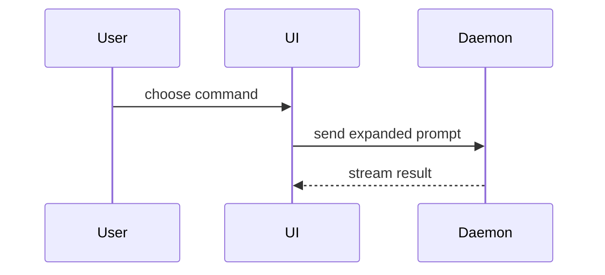

Pick the smallest view that makes the point clear. Put one short line of text next to each visual. Do not add a long explanation.

- Show logic or an algorithm as pseudocode:

```text
on(save)
  if content is unchanged
    return cached result
  write new content
  return fresh result
```

- Show runtime control flow as a call tree:

```text
submitForm
  createSession
    persistPrompt
    launchAgent
  navigateToSession
```

- Show UI structure as a component tree, including state and module boundaries that matter:

```tsx
<SessionPage> (apps/example/src/routes/session.tsx)
  useSessionEvents()
  <SessionToolbar>
    <RunSkillButton> (packages/ui)
```

- Show file responsibility or a broad refactor as a shallow file tree:

```text
src/
├── commands/       # parses user actions
├── sessions/       # owns session state
└── transport/      # sends API requests
```

- Show component interaction, control flow, or data flow with Mermaid:



- Use `diff` when the point is what changes and the surrounding shape already exists. Match the diff shape to the topic:

```diff
 submitForm
   createSession
     persistPrompt
+    expandSkillMention
     launchAgent
-  navigateToSession
+  navigateToSession
+    subscribeToEvents
```

- Show the whole block when most of it is new, or when the user needs a copyable target shape. Also show it whole when leaving out context would hide ownership or order.

- For a visual layout, a state comparison, or a concept too dense for Mermaid, write one focused HTML file to disk. Only do this when the user asks for a file. Say where you saved it. A headless session has no way to open it for the user.

Place each visual next to the short text it supports. Keep only the calls, files, props, states, and boundaries needed to answer the user's current question. Pick one of these views, or a few of them. Piling on every view at once buries the point instead of making it clear.

Stop after one visual and its one line of text. Add a second visual only if the user asks for one.
